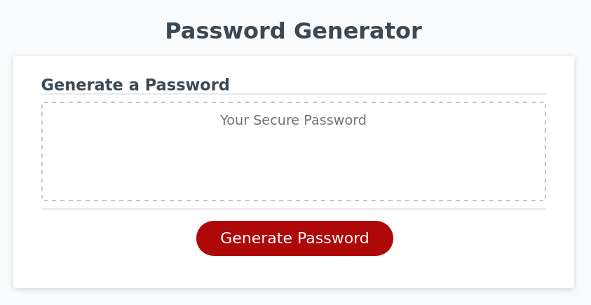
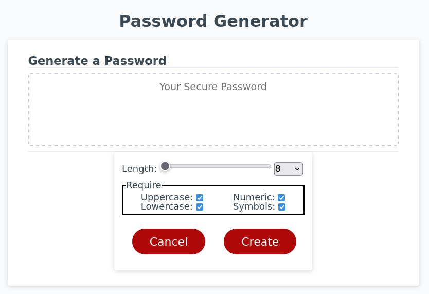
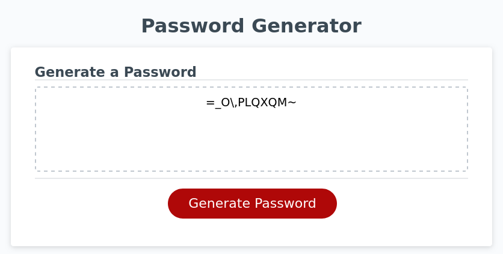
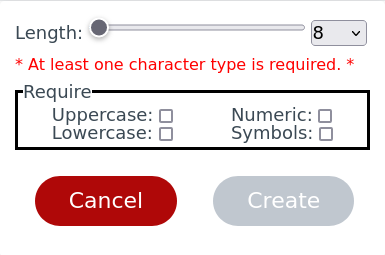

# Password Generator

Generate a string of text with specific requirements/constraints.

## Use

There are 2 properties of the generated string that can be controlled:

1. ***length***

    The length of the string can be set between 8 to 128 characters.

1. ***characters***

    The types of characters in the generated string can be constrained to a combination of 4 different types:

    - **uppercase** - uppercase letters 'A' through 'Z'.
    - **lowercase** - lowercase letters 'a' through 'z'.
    - **numeric** - numbers 0 through 9.
    - **symbols** - Non alphanumeric characters.

Once at least one character type is selected, the string can be generated.

## Preview

Upon entering the webpage, the user is presented with the following:

Clicking the "Generate Password" button causes the password criteria box to appear where the user can customize the
constraints of the generated password:

Once the desired constraints are selected and the "Create" button is clicked, the password criteria box disappears and
the generated password is displayed:

If no required character type is selected, an error message is displayed and the 'Create' button to generate the password
is disabled:

### Known Bugs

- When the page is refreshed, the states of the checkboxes, create button, range scale slider, and options dropdown become
  out of sync until they're interacted with by the user.

### Proposals

- The password criteria card that appears when user clicks "Generate Password" button is redundant. The password
  criteria card should always be visible and its valid/invalid state can make the "Generate Password" button
  disabled accordingly.

- When no required character types are selected, an error message appears causing the character requirements box to
  reposition itself lower. And then when a character type is selected and the error message disappears, the character
  requirements box repositions itself again. If this reposition didn't occur when the error message appears and
  disappears, that'd improve the UX.

- The character type labels and their corresponding checkbox html attributes are hard coded into the HTML. The property
  keys of the chars object is hardcoded into the JavaScript. If the property names and/or html attributes of either are
  changed so they don't match up anymore (casing ignored) this will break how the characters are retrieved from the
  chars object. This should probably be fixed.
